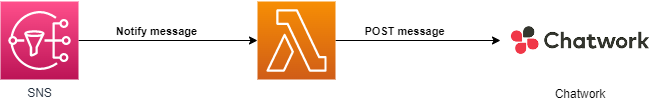

# sns-to-chatwork

This app publishes AWS SNS messages to Chatwork.

## App Architecture

## Installation Instructions

1. Store Chatwork token in SSM Parameter Store.
   - Name: `/chatwork_send_message/token`
   - Type: `SecureString`
   - KMS key source: `My current account`
   - KMS Key ID: `alias/aws/ssm`
   - Value: `replace_with_your_chatwork_token`
1. Go to the app's page on the [Serverless Application Repository](https://serverlessrepo.aws.amazon.com/applications/arn:aws:serverlessrepo:us-east-1:289559741701:applications~cw-logs-to-lambda) and click "Deploy"
1. Provide the required app parameters (see parameter details below) and click "Deploy"

## App Parameters

1. `SNSTopicArn` (required) - Subscribe a Lambda function to an Amazon SNS topic
1. `RoomId` (required) - Chatwork room id to receive message.

## License Summary

This code is made available under the MIT license. See the LICENSE file.
